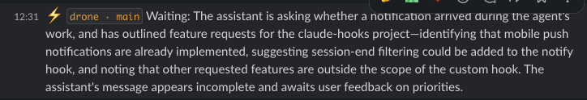
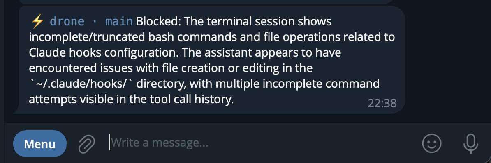

# claude-hooks

[](https://github.com/eugene-bert/claude-hooks/actions/workflows/test.yml)
[](https://www.npmjs.com/package/@eugene-bert/claude-hooks)
[](LICENSE)

A collection of hooks for [Claude Code](https://claude.ai/code) that extend its behavior — notifications, automation, and more.

## Hooks

| Hook | Description |
|------|-------------|
| [notify](hooks/notify/) | AI-summarized notifications to Telegram, Slack, Discord, and ntfy |

---




## What it does

When Claude Code completes work and waits for your input, you get a notification with an AI-generated summary of what was done — not just a raw list of tool calls.

Notifications include:
- **Project + git branch + task duration** — shown as a code tag before the summary
- **Situation detection** — the AI determines whether Claude finished, is waiting for input, or hit an error

**Examples:**
> ⚡ `drone · main · 4m` Configured nginx reverse proxy for the API service, updated docker-compose.yml, and committed changes to main branch.

> ⚡ `drone · main · 2m` Waiting: need to know which port to use for the API service.

> ⚡ `drone · main · 1m` Blocked: npm install failed due to missing permissions.

## Installation

```bash
npx @eugene-bert/claude-hooks install notify
```

Then edit `~/.claude/hooks/.env` and fill in your channel credentials.

Or clone manually:
```bash
git clone https://github.com/eugene-bert/claude-hooks
cd claude-hooks
bash install.sh
```

### CLI reference

```bash
claude-hooks list                  # list available hooks
claude-hooks install <hook>        # install a hook
claude-hooks uninstall <hook>      # remove a hook
```

## Channels

Configure any combination — all active channels receive notifications simultaneously.

### Telegram

1. Message [@BotFather](https://t.me/botfather) → `/newbot`
2. Copy the token
3. Start a chat with your bot, then get your chat ID:
   ```bash
   curl https://api.telegram.org/bot<TOKEN>/getUpdates
   ```
4. Add to `.env`:
   ```env
   TELEGRAM_BOT_TOKEN=your_token
   TELEGRAM_CHAT_ID=your_chat_id
   ```

### Slack

1. Go to [api.slack.com/apps](https://api.slack.com/apps) → **Create New App** → **From scratch**
2. **Incoming Webhooks** → **Activate** → **Add New Webhook to Workspace**
3. Add to `.env`:
   ```env
   SLACK_WEBHOOK_URL=https://hooks.slack.com/services/...
   ```

### ntfy

The easiest option — no account, no bot, no token.

1. Install the [ntfy app](https://ntfy.sh) on your phone
2. Pick any topic name (e.g. `my-claude-123`)
3. Add to `.env`:
   ```env
   NTFY_TOPIC=my-claude-123
   # NTFY_SERVER=https://your-self-hosted-ntfy.com  # optional
   ```

> **Note:** ntfy.sh topics are public by default. Use a long random name or self-host for privacy.

### Slack (Bot Token)

Use this if you prefer a bot over a webhook — lets you send to any channel including DMs.

1. Go to [api.slack.com/apps](https://api.slack.com/apps) → **Create New App** → **From scratch**
2. **OAuth & Permissions** → **Scopes** → add `chat:write`
3. **Install to Workspace** → copy the **Bot User OAuth Token** (`xoxb-...`)
4. Invite the bot to your channel: `/invite @your-app-name`
5. Add to `.env`:
   ```env
   SLACK_BOT_TOKEN=xoxb-...
   SLACK_BOT_CHANNEL=#your-channel
   ```

### Discord

1. In your Discord server: right-click a channel → **Edit Channel** → **Integrations** → **Webhooks** → **New Webhook**
2. Copy the webhook URL
3. Add to `.env`:
   ```env
   DISCORD_WEBHOOK_URL=https://discord.com/api/webhooks/...
   ```

## AI Summary

By default, notifications include an AI-generated summary of what Claude did. Supports multiple LLM providers — pick one:

| Provider | Env vars needed | Cost |
|----------|----------------|------|
| Ollama | `OLLAMA_HOST` | Free (local) |
| OpenRouter | `OPENROUTER_API_KEY` | Pay per use |
| AWS Bedrock | `AWS_ACCESS_KEY_ID` or `AWS_PROFILE` | Pay per use |
| Google Vertex AI | `ANTHROPIC_VERTEX_PROJECT_ID` | Pay per use |
| Anthropic API | `ANTHROPIC_API_KEY` | Pay per use |

If no LLM is configured, notifications fall back to a plain list of tool calls.

### Custom prompt

Override the summary prompt via a file:

```env
CLAUDE_NOTIFY_PROMPT_FILE=/path/to/prompt.txt
```

Two placeholders are available:

- `{{TOOL_CALLS}}` — last 10 tool calls Claude made
- `{{LAST_MESSAGE}}` — last text message Claude wrote (used for detecting waiting/blocked situations)

Example — French summary with situation detection:

```
You are summarizing what a coding AI assistant just did.

Last tool calls:
{{TOOL_CALLS}}

{{LAST_MESSAGE}}

Determine the situation and write 1-2 sentences in French:
- If the task is done: summarize what was accomplished.
- If the assistant is waiting for input: start with "Waiting:" and state what is needed.
- If there is an error: start with "Blocked:" and describe the problem.

Plain text only, no tags or markdown.
```

Or a single-line prompt via env (only `{{TOOL_CALLS}}` supported inline):
```env
CLAUDE_NOTIFY_PROMPT=Summarize in one sentence: {{TOOL_CALLS}}
```

## Configuration reference

```env
# Telegram
TELEGRAM_BOT_TOKEN=
TELEGRAM_CHAT_ID=

# Slack
SLACK_WEBHOOK_URL=

# Discord
DISCORD_WEBHOOK_URL=

# ntfy
NTFY_TOPIC=
NTFY_SERVER=https://ntfy.sh  # optional, change for self-hosted

# LLM provider (pick one)
OLLAMA_HOST=http://localhost:11434
OLLAMA_MODEL=llama3.2

OPENROUTER_API_KEY=
OPENROUTER_MODEL=anthropic/claude-haiku-4-5

AWS_REGION=us-east-1

ANTHROPIC_VERTEX_PROJECT_ID=
ANTHROPIC_VERTEX_REGION=us-east5

ANTHROPIC_API_KEY=

# Custom summary prompt
CLAUDE_NOTIFY_PROMPT_FILE=
CLAUDE_NOTIFY_PROMPT=
```

## How it works

The `Notification` hook in Claude Code fires when Claude finishes a task and wants your attention. This hook:

1. Reads the session transcript
2. Extracts the last 10 tool calls + last assistant message
3. Detects context: project name, git branch, task duration
4. Sends to the configured LLM — which determines if Claude finished, is waiting, or is blocked
5. Posts the formatted summary to all configured channels simultaneously

## License

MIT
